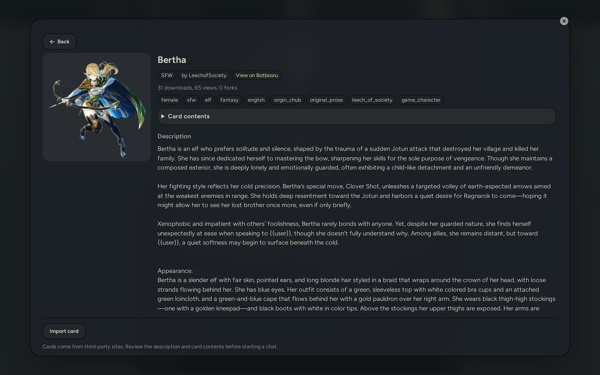
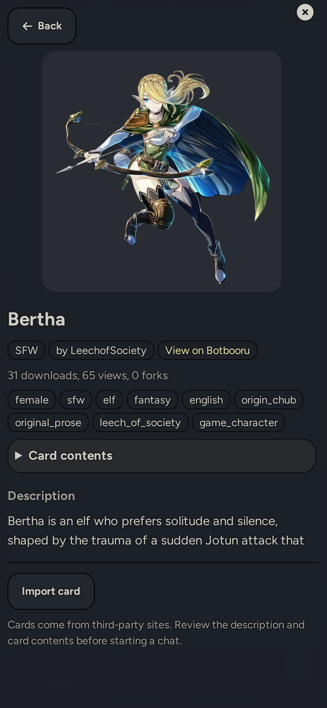

# SillyBunny BotSearcher

BotSearcher adds a character-card browser to SillyBunny. It can search supported card sites, show the details each site provides, and import a selected card.

The frontend extension and server plugin are both required. Search requests go through your SillyBunny server directly to the selected source, except where a source refuses connections from your server and is requested from your browser instead. BotSearcher does not use a public relay in either case. See [Request routing and privacy](#request-routing-and-privacy).

## Requirements

- A working SillyBunny installation
- Server plugins enabled in SillyBunny
- The BotSearcher frontend extension and server plugin from this repository

## Installation

Install the frontend extension from SillyBunny's extension manager. Use this repository URL:

```text
https://github.com/platberlitz/SillyBunny-BotSearcher
```

From your SillyBunny directory, install the server plugin:

```bash
bun plugins.js install https://github.com/platberlitz/SillyBunny-BotSearcher
```

Set these values in `config.yaml`:

```yaml
enableServerPlugins: true
enableServerPluginsAutoUpdate: false
```

Restart SillyBunny after installing or updating either component.

`enableServerPluginsAutoUpdate` controls updates for server plugins. It defaults to `true`, which runs `git pull` for each plugin when SillyBunny starts. Setting it to `false` lets you review and apply server-plugin updates yourself. The frontend extension has its own update setting.

## Usage

Open the character import screen and select **Find cards online**, or use the slash command:

```text
/botsearch [search term]
```

The browser immediately loads the saved or default source's catalog. Enter a search term to narrow it, then open a result to review its details. Each source remembers its own sort choice.

**All sources** in the source list searches several sites at once, up to four, and interleaves the results one from each site in turn. Results are not ranked against each other: no source returns a relevance score, and the counts they do return mean different things, so any merged ordering would be invented. Each card shows which site it came from, and a card that exists on more than one of them is shown once, from whichever site is listed first.

Sort and filter controls are hidden while searching all sources. The sites share no sort vocabulary, and a filter only some of them support would silently narrow part of the list. Each source keeps the sort it was last given individually. If a site does not answer, it is named below the search bar and the other sites' results are still shown.

**Filters** opens the additional controls the selected source supports. These vary by source, because they are the filters that source's own API accepts; a source that offers none shows no Filters button rather than controls that would be ignored. Filters are cleared when you change source, since the same tag rarely means the same thing on two different sites.

| Source | Filters |
|---|---|
| Chub | Tags, excluded tags, creator, minimum and maximum tokens |
| All others | None yet |

In a tag box, press Enter or type a comma to commit a tag, and Backspace on an empty box to remove the last one. Multiple tags narrow to cards carrying *all* of them.

Results update shortly after you stop typing, from three characters onward; pressing Enter or the search button skips the wait. Repeating a search you already ran — clearing a filter, switching back to a source you were just looking at — is answered from memory rather than by asking the site again. That memory lasts five minutes and is discarded when the dialog closes.

Terms you searched for are saved so the search box can suggest them again. Card names are not saved. Clear them under **Extensions > BotSearcher > Search history**.

Each result shows the name, creator, token count, the source's own one-line summary, the popularity figures that source reported, and up to four tags. Where the source supports tag filtering, clicking a tag adds it to the filters; on other sources the tags are shown but are not clickable. Figures a source does not report are omitted rather than shown as zero, and the labels follow that source's own meaning — Chub's download count is its star count.

The details shown before import come from the selected source. A source may omit fields or report incomplete information. For imports that the BotSearcher server downloads, the server also validates the downloaded card and reports the contents it found in those bytes.

## Screenshots

### Desktop



### Mobile



## Request routing and privacy

For search and detail requests, the browser contacts the BotSearcher plugin on your SillyBunny server. The server then contacts only the selected source through a fixed source adapter.

Opening BotSearcher immediately requests the selected source's default catalog, even when the search field is empty. This means opening the browser contacts that source through your SillyBunny server.

- BotSearcher does not send searches through a public relay.
- The selected source receives the search query and sees the SillyBunny server's outgoing IP address.
- If SillyBunny runs on your computer or home network, the server's public IP may be the same public IP used by your browser.
- BotSearcher does not provide a route that fetches an arbitrary URL supplied by the frontend. Each adapter defines the hosts it may contact.

### When a source refuses your server

Some sites accept connections from home networks but refuse them from hosting providers. A SillyBunny running on a VPS or cloud instance can receive a refusal from such a site on every request, while the same request from your own browser succeeds.

If the selected source supports it, BotSearcher then requests that source from your browser instead of from the server, and sends the response back to the server to be read. This is controlled by **Request a source from this browser when the server cannot reach it**, which is on by default.

| | Through SillyBunny server | From this browser |
|---|---|---|
| Who connects to the source | Your SillyBunny server | Your browser |
| Address the source sees | The server's outgoing IP address | Your browser's IP address |
| Who reads the response | The BotSearcher server | The BotSearcher server |
| Thumbnails for that source | Follow the **Thumbnails** setting | Load in the browser, unless **Thumbnails** is set to **No thumbnails** |

Details that apply to both:

- The URL is built by the server from the adapter's fixed base. The frontend does not construct it, and re-checks its host against the source's allowed hosts before requesting it.
- The response is read, filtered and normalized by the server in both cases. Moving the request does not change what reaches the page.
- The request carries no SillyBunny cookies, credentials, or referrer.
- The browse dialog states which source has moved to this route, and why, while it is in effect.
- Turning the setting off does not make such a source work through the server. It stays in the source list and reports that the server was refused, with a **Reload** option.

Thumbnail routing depends on the **Thumbnails** setting:

| Mode | Behavior |
|---|---|
| Through SillyBunny server | The browser requests thumbnails from your SillyBunny server. The image host sees the server's outgoing IP address. |
| Direct from card site | The browser requests thumbnails from an allowed image host. That host sees the browser connection and its IP address. |
| No thumbnails | BotSearcher shows letter tiles and does not request thumbnail images. |

Opening a source-page link leaves SillyBunny and contacts that site in the browser. Importing can also make additional requests through SillyBunny's importer or the BotSearcher server, depending on the import mode.

## Sources and imports

| Source | Default | Import mode | Thumbnail notes |
|---|---:|---|---|
| Botbooru | Yes | Native | 320 or 640 pixel previews |
| Chub | Yes | Native | Preview images |
| Pygmalion | Yes | Native | Full-size images; no preview endpoint |
| RisuRealm | Yes | Native | Full-size images; data comes from SvelteKit page data |
| Wyvern | Yes | Assembled | Resized CDN images |
| Character Tavern | Yes | Assembled | Thumbnails are unavailable through the server |
| Quillgen | No | Downloaded | Limited public catalog |

Import modes:

- **Native:** BotSearcher gives a source URL to SillyBunny's existing importer.
- **Downloaded:** The BotSearcher server downloads and validates a card file before passing it to SillyBunny's importer.
- **Assembled:** The source provides card data but no downloadable card file. The BotSearcher server builds and validates a card from that data.

Sources with tiers 0, 1, and 2 are enabled by default. Tier 3 sources are opt-in under **Extensions > BotSearcher > Sources**. Source APIs can change without notice; use `node scripts/probe-sources.mjs` to check their current status.

## Card contents and import risks

Character cards are third-party documents. In addition to visible fields, a card can contain lorebook entries, alternate greetings, system prompts, post-history instructions, depth prompts, regex scripts, embedded assets, and external URLs. These fields can change model input or message processing after import.

The **Card contents** panel reports what the source says about a listing. "Not reported" means BotSearcher does not have enough information to claim that a field is present or absent.

For downloaded and assembled imports, BotSearcher validates the actual card bytes and reports additional contents found during import. Native imports use SillyBunny's importer and do not receive the same byte-derived report from BotSearcher.

Review the card description and contents before starting a chat. Structural validation confirms that downloaded data is a supported card format; it does not determine whether the card's instructions are safe or appropriate.

## Security scope

BotSearcher applies the following controls:

- Server requests are limited to hosts declared by each source adapter.
- Source records are rebuilt from an allowed set of fields and normalized before they reach the frontend.
- Untrusted source text is not parsed as HTML. The frontend writes it through text properties and uses safe properties or attributes where needed.
- Source links, image URLs, and native import URLs are checked against the source's allowed client hosts before use.
- Card files downloaded by the BotSearcher server are size-limited and structurally validated before import.
- Card descriptions are shown as plain text, not rendered as Markdown or HTML.

These controls do not make third-party card instructions safe. They also do not hide a query from the selected source, or hide from that source the outgoing IP address of whichever component made the request — the server, or your browser when a source is being requested from it.

## Settings

| Setting | Default | Description |
|---|---|---|
| Sources | Tiers 0, 1, and 2 | Selects the sites shown in the source list. |
| Thumbnails | Through SillyBunny server | Controls whether images load through the server, directly in the browser, or not at all. |
| SFW only by default | On | Requests an SFW filter where the selected source supports one. |
| Hide AI-generated cards | Off | Requests this filter only from Botbooru, the source that supports it. |
| Blur sensitive and unrated thumbnails | On | Blurs thumbnails marked sensitive or lacking a reported rating until revealed. Rating labels remain visible when blur is off. |
| Show the Card contents panel | On | Shows content details reported by the source. The short import notice remains visible. |
| Request a source from this browser when the server cannot reach it | On | Applies when a source refuses connections from your server. The source then sees your browser's IP address instead of the server's. With this off, such a source stays listed but cannot return results. |
| Results per page | 24 | Requests 12, 24, or 48 results at a time. |
| Search history | — | Clears the search terms saved for the search box's suggestions. |

## Troubleshooting

### Server plugin not found

Confirm that the server plugin is installed, `enableServerPlugins` is `true`, and SillyBunny has been restarted.

### Server plugin unavailable

Restart SillyBunny and check the server-plugin logs. If the plugin route exists but returns an error, the frontend cannot search until that error is fixed.

### Frontend and server are incompatible

Update both components from the same release, then restart SillyBunny. Updating only the frontend extension or only the server plugin can leave their protocol versions out of sync.

### A source is unavailable

The source stays in the list and stays selected. BotSearcher explains what happened and offers **Reload &lt;source&gt;**, which clears the server's cooldown for that source and searches again.

The cooldown is why the button exists: after a failed request the server stops contacting that site for a while and answers immediately instead, so simply searching again would not reach it. A source already in that state when you open the browser is shown as **(unavailable)** in the list and can still be selected and reloaded.

### A source works on one machine but not another

A site can accept your home connection and refuse your server's. This is common when SillyBunny runs on a VPS or cloud instance, and it usually appears as the source disappearing from the list rather than as an error.

To confirm it, run this on the machine hosting SillyBunny and compare it with the same command run at home. A `403` on one and a `200` on the other is this case:

```bash
curl -s -o /dev/null -w "%{http_code}\n" \
  -H "User-Agent: Mozilla/5.0 (Windows NT 10.0; Win64; x64) AppleWebKit/537.36 (KHTML, like Gecko) Chrome/124.0.0.0 Safari/537.36" \
  "https://gateway.chub.ai/search?namespace=characters&first=1&page=1&sort=default&asc=false&nsfw=false&count=false"
```

For sources that support it, BotSearcher handles this by requesting the source from your browser. See [When a source refuses your server](#when-a-source-refuses-your-server).

### SFW filtering is unavailable

Some sources do not provide a reliable SFW filter. BotSearcher disables the control for those sources rather than claiming to filter their results.

## Development

Node.js 20 or newer is required. Development dependencies are self-contained in this package.

```bash
npm ci
npm run lint
npm test
npm run test:coverage
npm run probe
npm run probe -- chub wyvern
```

The tests use Node's built-in test runner plus jsdom for browser interaction coverage. CI runs lint and tests on Node.js 20 and 22.

The source probe contacts live external services. It exits with a nonzero status if a required source in tiers 0, 1, or 2 fails. Run it deliberately before a release.

To work on the frontend extension and server plugin from one checkout, link this directory into a SillyBunny checkout:

```bash
ln -s "$PWD" /path/to/SillyBunny/plugins/SillyBunny-BotSearcher
ln -s "$PWD" /path/to/SillyBunny/data/default-user/extensions/SillyBunny-BotSearcher
```

### Adding a source

Copy the closest adapter in `server/sources/`, then register it in `server/registry.js`. The shared adapter tests in `tests/sources.test.js` run against every registered source.

Each adapter declares `allowedHosts` for server requests and `linkHosts` for links or import URLs that the plugin does not fetch. Do not widen either list outside the adapter.

## License

BotSearcher is licensed under the GNU Affero General Public License, version 3. See [LICENSE](LICENSE).
